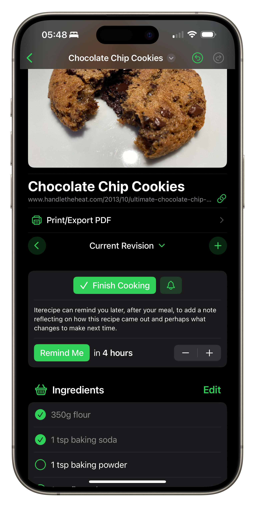
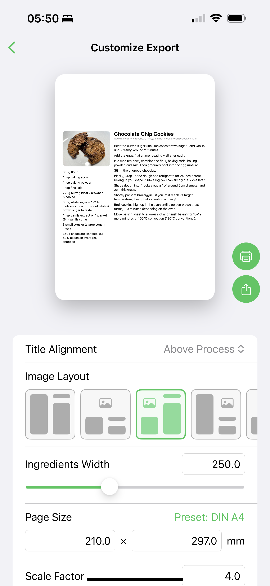
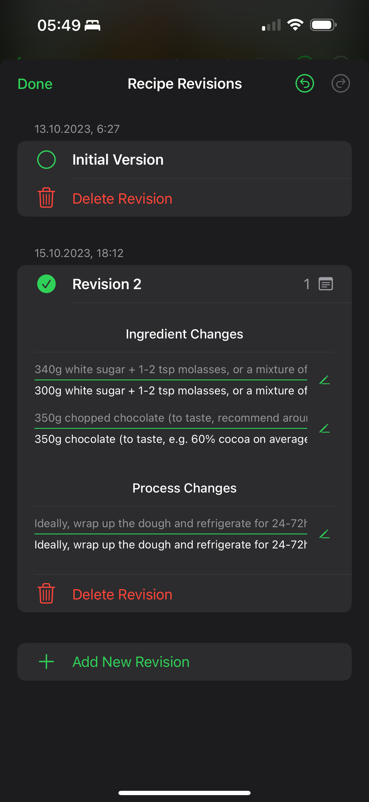

    

# Iterecipe

A recipe app for nerds, built around iterating on a recipe over time. Recipes are stored as regular old documents, allowing you to easily share and collaborate with others. Additionally, you can print or export as PDF, with deep customization of the page layout.

    

    
    

